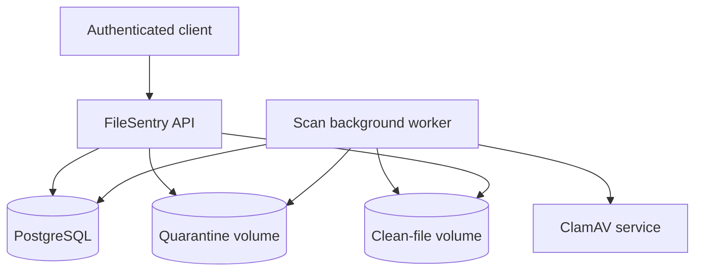
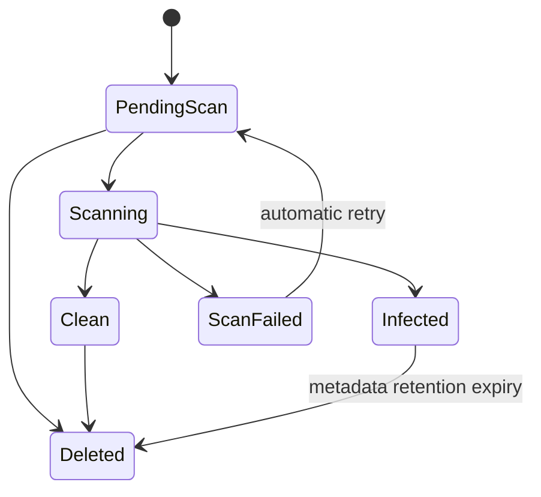

# FileSentry Project Plan

> A secure file-upload and malware-scanning API built with ASP.NET Core, PostgreSQL, ClamAV, and Docker.

[](https://dotnet.microsoft.com/)
[](https://www.postgresql.org/)
[](https://www.clamav.net/)
[](https://www.docker.com/)

**Status:** Design complete; implementation planned  
**Architecture:** Modular monolith with a database-backed background scanner  
**License:** MIT (planned)

## Contents

- [Overview](#overview)
- [Key Capabilities](#key-capabilities)
- [Architecture](#architecture)
- [Security Model](#security-model)
- [Supported File Policy](#supported-file-policy)
- [Upload and Scan Workflows](#secure-upload-workflow)
- [API](#api)
- [Data Model](#data-model)
- [Storage and ClamAV Integration](#storage-design)
- [Testing](#testing)
- [Local Development](#local-development)
- [Implementation Roadmap](#implementation-roadmap)
- [Acceptance Criteria](#acceptance-criteria)
- [Limitations](#limitations)
- [Future Enhancements](#future-enhancements)

---

## Overview

Applications that accept PDF, Microsoft Office, and image uploads create a security boundary between untrusted user content and internal systems. Checking only a filename or MIME type is insufficient: an attacker can rename an executable, submit malformed content, attempt path traversal, upload malware, or try to access another user's file.

FileSentry demonstrates a secure upload pipeline with the following principle:

> Every uploaded file is untrusted until it has passed validation and malware scanning.

The API will:

1. authenticate the caller;
2. enforce upload and content-type restrictions;
3. stream the file into non-public quarantine storage;
4. calculate its SHA-256 hash;
5. persist a scan job;
6. scan the content with a locally hosted ClamAV service;
7. release clean files into protected storage;
8. delete infected content while retaining audit metadata; and
9. allow only the owning user to retrieve a clean file.

FileSentry is intentionally backend-only. Its scope centers on security controls, durable state management, failure handling, automated tests, containerized infrastructure, and reproducible documentation.

---

## Key Capabilities

- ASP.NET Core REST API with OpenAPI documentation
- ASP.NET Core Identity and JWT bearer authentication
- Object-level authorization for file metadata, download, and deletion
- Streaming multipart uploads with an enforced 10 MiB limit
- Extension allowlisting and server-side file-signature verification
- SHA-256 hashing during upload
- Non-public quarantine and clean-file storage areas
- Asynchronous, database-backed ClamAV scanning
- Fail-closed scanner error handling and bounded retries
- Durable scan-state recovery after application restarts
- Structured audit events and health checks
- Unit, integration, and security-focused automated tests
- Docker Compose development environment and GitHub Actions CI

---

## Problem Statement

Many upload endpoints perform only superficial checks and then place user-controlled files in a publicly accessible directory. This can lead to:

- malware reaching employees or downstream services;
- executable content being disguised with an allowed extension;
- path traversal or unsafe filename handling;
- unauthorized access to another user's files;
- premature download before a scan finishes;
- exposure when the malware scanner is unavailable;
- unbounded storage or denial-of-service attacks;
- insufficient records for incident investigation.

FileSentry will implement a reference upload pipeline that treats scanning as a security gate rather than a best-effort background feature.

---

## Objectives

### Functional Objectives

- Allow a user to register and authenticate.
- Accept supported files through a multipart upload endpoint.
- Store new uploads in a non-public quarantine directory.
- Expose the current validation and scan status.
- Scan file bytes using a local ClamAV container.
- Permit download only after a clean scan result.
- Restrict file metadata and content to the owning user.
- Delete an infected file's stored bytes after detection.
- Preserve hashes, scan results, and audit records for demonstration.
- Allow a user to delete their own file and associated stored bytes.

### Engineering Objectives

- Start the complete environment with one Docker Compose command.
- Persist workflow state so an API restart does not lose pending scans.
- Fail closed when ClamAV cannot return a conclusive clean result.
- Provide deterministic validation and state-transition tests.
- Run build and automated tests in GitHub Actions.
- Include health endpoints for the API, database, and scanner dependency.

### Documentation Objectives

- Explain the threat model and trust boundaries.
- Explain why extension and MIME checks alone are insufficient.
- Document security decisions and their tradeoffs.
- Provide reproducible setup and API usage instructions.
- Publish reproducible test results and known limitations.

---

## Non-Goals

The following features are deliberately outside the initial release:

- a React or mobile frontend;
- Kubernetes deployment;
- microservice decomposition;
- cloud object storage such as Amazon S3 or Azure Blob Storage;
- commercial antivirus engines or multi-engine scanning;
- content-disarm-and-reconstruction (CDR);
- OCR or document text extraction;
- LLM analysis or classification;
- automatic execution or preview of uploaded content;
- public share links;
- resumable or chunked uploads;
- multi-region or high-availability deployment;
- distributed processing by multiple scan workers;
- claiming that a clean result guarantees a harmless file.

These may appear in the future-work section, but they should not delay the MVP.

---

## Users and Roles

### User

An authenticated user can:

- upload a file;
- list their own file records;
- inspect their own file's status;
- download their own file only when its status is `Clean`;
- delete their own file.

### Administrator

An administrator role is optional for the MVP. If implemented, it may view system-level scan metadata and failed jobs, but it must not be required for the primary demonstration.

### System Worker

An internal background process claims pending scan jobs, communicates with ClamAV, updates statuses, moves clean files, and removes infected bytes. It is not an externally authenticated user.

---

## Technology Stack

| Area | Technology | Purpose |
|---|---|---|
| API | ASP.NET Core Web API on .NET 10 | Matches the intended backend profile and supports modern hosting, validation, authentication, and background services |
| Language | C# | Primary implementation language |
| Database | PostgreSQL | Production-style relational database with strong transaction support |
| ORM | Entity Framework Core | Migrations, query composition, and integration with ASP.NET Core |
| Malware scanner | ClamAV | Free, local, Docker-friendly scanner suitable for demonstrating the pipeline |
| File storage | Local mounted volumes | Keeps the MVP reproducible and avoids cloud cost and credentials |
| Authentication | ASP.NET Core Identity with JWT bearer tokens | Demonstrates authentication and per-user resource authorization |
| Background work | ASP.NET Core `BackgroundService` | Sufficient for a single-process MVP with database-backed state |
| API documentation | OpenAPI | Allows endpoints and schemas to be explored and tested |
| Unit/integration testing | xUnit, WebApplicationFactory, Testcontainers | Supports application and real-dependency testing |
| Local orchestration | Docker Compose | Runs the API, PostgreSQL, and ClamAV together |
| CI | GitHub Actions | Proves that the project builds and tests on each push |

### Architecture Decisions

- The project will be a **modular monolith**, not a microservice system.
- ClamAV will be reachable only on the internal Docker network. Its port must not be published to the public internet.
- Local storage is acceptable for the MVP because storage abstraction and secure access are more important than a cloud-vendor integration.
- PostgreSQL workflow records are the source of truth. Filesystem contents alone must not determine business status.

---

## Architecture



### Component Responsibilities

#### API

- validates authentication and ownership;
- accepts a bounded upload stream;
- performs initial filename, extension, and signature validation;
- generates internal identifiers and storage names;
- writes the quarantined file and database record;
- returns status metadata;
- streams clean files through an authorized download endpoint.

#### PostgreSQL

- stores users and authentication data;
- stores file metadata and current state;
- stores scan attempts and error classifications;
- stores security-relevant audit events.

#### Background Worker

- selects pending records;
- marks a record as scanning;
- sends file content to ClamAV;
- records the scanner result and signature database version when available;
- atomically moves clean files to protected clean storage;
- deletes infected bytes;
- classifies scanner errors without marking a file clean;
- reclaims jobs left in `Scanning` after an application crash.

#### ClamAV

- maintains local malware signatures;
- scans byte streams supplied over the internal network;
- returns `Clean`, `Infected`, or an error/inconclusive result.

#### Storage Volumes

- are mounted outside any public web root;
- use generated identifiers rather than user-controlled paths;
- separate quarantined and clean content;
- are accessed only by the application and worker.

---

## Trust Boundaries

1. **Client to API:** all request data, headers, filenames, MIME types, and bytes are untrusted.
2. **API to storage:** only validated internal paths may cross this boundary.
3. **Quarantine to scanner:** quarantined files remain untrusted during scanning.
4. **Scanner result to clean storage:** only a conclusive `Clean` result may permit promotion.
5. **User to file record:** authentication does not imply ownership; authorization must be checked for every file identifier.
6. **Application to database:** database state must be updated transactionally where required, but stored metadata must still be safely encoded when returned.

---

## Security Model

### Protected Assets

- application host and containers;
- stored clean files;
- user identities and credentials;
- file ownership information;
- database integrity;
- service availability;
- audit evidence;
- downstream users who download files.

### Threats and Controls

| Threat | Example | Planned control |
|---|---|---|
| Malware upload | EICAR or known malicious document | Quarantine plus ClamAV scan before release |
| Extension spoofing | Executable renamed to `.pdf` | Extension allowlist plus magic-byte/content-signature validation |
| Path traversal | Filename `../../appsettings.json` | Ignore original name for storage; generated UUID-based path |
| Insecure direct object reference | User A requests User B's file ID | Ownership predicate in every metadata/download/delete query |
| Premature access | Download requested while scan is pending | Download allowed only for `Clean` state |
| Scanner outage | ClamAV timeout or unavailable | Fail closed; status becomes/reverts to a non-downloadable failure state |
| Oversized upload | Very large request exhausts disk or memory | Request limit, streaming copy, byte counter, early termination |
| Memory exhaustion | API buffers entire file | Stream directly to a temporary quarantine file while hashing |
| MIME trust | Client sends `application/pdf` for arbitrary bytes | Treat client MIME only as metadata; verify server-side |
| Filename injection | Control characters or header manipulation | Store original name only as sanitized display metadata; framework-generated content disposition |
| Archive bomb | Deeply nested compressed content | No generic archives in MVP; DOCX receives format-specific checks and ClamAV limits |
| Duplicate content abuse | Same bytes repeatedly uploaded | SHA-256 recorded; per-user rate and quota controls; deduplication is not required |
| Password attack | Credential stuffing/brute force | Identity password policy, login rate limiting, generic authentication errors |
| Token theft | Long-lived bearer token exposed | Short token lifetime, HTTPS requirement outside local development, no token logging |
| Log injection or sensitive logging | Raw filename/token/file content logged | Structured logs and metadata allowlist; never log file bytes or bearer tokens |
| Race condition | Delete occurs while worker scans | Defined state transitions and guarded updates; worker rechecks current record state |

### Residual Risk

A ClamAV `Clean` response means no configured signature or heuristic identified the file at scan time. It is not proof that the content is harmless. Zero-day malware, parser vulnerabilities, malicious macros, and social-engineering content may remain undetected. The README and final report must state this limitation explicitly.

---

## Supported File Policy

### Initial Allowlist

The initial release accepts:

- PDF (`.pdf`);
- PNG (`.png`);
- JPEG (`.jpg`, `.jpeg`);
- Microsoft Word Open XML (`.docx`).

### Rejected Types

The MVP rejects:

- executables and scripts;
- generic ZIP/RAR/7z archives;
- macro-enabled Office documents such as `.docm`;
- legacy binary Office formats such as `.doc`;
- HTML and SVG;
- files with no recognized allowed signature;
- files whose extension and verified format disagree.

### Size Limits

- Maximum file size: **10 MiB** per upload.
- The server must enforce the limit while streaming, not only through the reported multipart length.
- A per-user request rate limit will reduce rapid repeated uploads.
- A total per-user storage quota may be added if it fits within the sprint; otherwise it will be documented as future work.

### Format Verification

- PDF must begin with a valid PDF signature and receive basic structural validation.
- PNG and JPEG must match their expected binary signatures.
- DOCX must be recognized as an Open XML ZIP package and contain the required Word package entries; being a ZIP file alone is not sufficient.
- Client-supplied `Content-Type` is recorded only for comparison and diagnostics.

---

## Secure Upload Workflow

1. Authenticate the request.
2. Apply endpoint rate limiting.
3. Validate that exactly one supported multipart file is present.
4. Reject an empty file or a request exceeding the configured limit.
5. Normalize the original filename for display metadata; never use it as a path.
6. Generate a file ID and unpredictable internal storage name.
7. Stream bytes into a temporary file inside quarantine.
8. While streaming:
   - enforce the actual byte limit;
   - compute SHA-256;
   - capture the initial signature bytes required for type detection.
9. Verify that extension, detected type, and allowed policy agree.
10. Persist the `FileRecord` as `PendingScan`.
11. Atomically publish the temporary quarantine file under its internal name.
12. Return `202 Accepted` with the file ID, status, and status URL.
13. Let the background worker scan the file asynchronously.

If validation or persistence fails, the temporary file must be removed. The API must not return a successful record whose bytes were not safely committed.

---

## Scan Workflow and State Model



### Status Definitions

| Status | Meaning | Download permitted? |
|---|---|---|
| `PendingScan` | File is quarantined and awaiting a worker | No |
| `Scanning` | A worker is actively scanning the file | No |
| `Clean` | ClamAV returned a conclusive clean result and the file was promoted | Yes, owner only |
| `Infected` | Malware was detected; stored bytes are deleted | No |
| `ScanFailed` | Scan was inconclusive due to timeout, protocol, or dependency error | No |
| `Deleted` | User deletion or retention cleanup completed | No |

### Retry Policy

- A failed scan may be retried automatically up to three times.
- Retries use bounded exponential backoff.
- Malware detection is not retryable.
- Validation failure is not retryable.
- A scanner outage must never change the state to `Clean`.
- A `Scanning` job older than a configured lock timeout may be reclaimed after application restart.

### Promotion and Deletion

- A clean file is moved from quarantine to clean storage using an atomic filesystem move when both locations share a volume/filesystem.
- An infected file's bytes are deleted promptly; its database record retains the hash, classification, detection name, timestamps, and audit reference.
- A failed-scan file remains quarantined until retry exhaustion or administrative cleanup.

---

## API

Base path: `/api/v1`

### Authentication

| Method | Endpoint | Purpose |
|---|---|---|
| `POST` | `/auth/register` | Create a user account |
| `POST` | `/auth/login` | Return a short-lived JWT access token |

### Files

| Method | Endpoint | Purpose | Success response |
|---|---|---|---|
| `POST` | `/files` | Upload one file to quarantine | `202 Accepted` |
| `GET` | `/files` | List caller-owned file records | `200 OK` |
| `GET` | `/files/{fileId}` | Get caller-owned metadata and current status | `200 OK` |
| `GET` | `/files/{fileId}/download` | Stream a caller-owned clean file | `200 OK` |
| `DELETE` | `/files/{fileId}` | Delete a caller-owned file | `204 No Content` |

### Health

| Method | Endpoint | Purpose |
|---|---|---|
| `GET` | `/health/live` | Confirm the process is running |
| `GET` | `/health/ready` | Confirm database and scanner connectivity |

### Example Upload Response

```json
{
  "fileId": "83ad6212-0211-4fab-a094-c35e07c86f91",
  "originalFileName": "project-report.pdf",
  "sizeBytes": 482193,
  "sha256": "8f9b7f...",
  "detectedMediaType": "application/pdf",
  "status": "PendingScan",
  "statusUrl": "/api/v1/files/83ad6212-0211-4fab-a094-c35e07c86f91"
}
```

### Error Format

Errors should use `application/problem+json` and contain a stable machine-readable error code in addition to the human-readable title/detail.

Example error codes:

- `FILE_TOO_LARGE`
- `EMPTY_FILE`
- `UNSUPPORTED_EXTENSION`
- `CONTENT_TYPE_MISMATCH`
- `INVALID_FILE_SIGNATURE`
- `FILE_NOT_FOUND`
- `FILE_NOT_CLEAN`
- `UPLOAD_RATE_LIMITED`
- `SCANNER_UNAVAILABLE`

The API must avoid revealing whether another user's file ID exists. An unauthorized ownership lookup should behave as not found.

---

## Data Model

### User

| Field | Type | Notes |
|---|---|---|
| `Id` | UUID/string according to Identity | Primary identifier |
| `Email` | string | Unique, normalized by Identity |
| `PasswordHash` | string | Never store plaintext passwords |
| `CreatedAtUtc` | timestamp | Audit metadata |

### FileRecord

| Field | Type | Notes |
|---|---|---|
| `Id` | UUID | Public opaque file identifier |
| `OwnerId` | FK | Required ownership boundary |
| `OriginalFileName` | string | Sanitized display metadata only |
| `InternalStorageName` | string | Generated; never supplied by client |
| `ClientMediaType` | string | Untrusted client claim |
| `DetectedMediaType` | string | Server-verified type |
| `Extension` | string | Normalized allowed extension |
| `SizeBytes` | long | Actual streamed byte count |
| `Sha256` | fixed-length string/bytes | Content hash |
| `Status` | enum/string | Current workflow state |
| `StorageArea` | enum/string | Quarantine, clean, or none |
| `CreatedAtUtc` | timestamp | Upload creation time |
| `UpdatedAtUtc` | timestamp | Last state change |
| `CleanedOrDeletedAtUtc` | nullable timestamp | Retention/audit support |
| `RowVersion` | concurrency token | Guards conflicting updates |

Indexes should include `(OwnerId, CreatedAtUtc)`, `Status`, and `Sha256` as appropriate.

### ScanAttempt

| Field | Type | Notes |
|---|---|---|
| `Id` | UUID | Attempt identifier |
| `FileId` | FK | Associated file |
| `AttemptNumber` | integer | Starts at 1 |
| `StartedAtUtc` | timestamp | Worker start |
| `CompletedAtUtc` | nullable timestamp | Completion time |
| `Result` | enum/string | Clean, infected, failed |
| `DetectionName` | nullable string | Malware signature name when infected |
| `ScannerVersion` | nullable string | Scanner metadata where available |
| `SignatureVersion` | nullable string | Signature database version where available |
| `ErrorCode` | nullable string | Stable internal classification |
| `SafeErrorDetail` | nullable string | No secrets or raw content |

### AuditEvent

| Field | Type | Notes |
|---|---|---|
| `Id` | UUID | Event identifier |
| `ActorUserId` | nullable FK | Null for internal worker events |
| `FileId` | nullable FK | Related file |
| `EventType` | string | Uploaded, scan started, clean, infected, download, delete, failure |
| `OccurredAtUtc` | timestamp | Event time |
| `CorrelationId` | string | Connects request and worker logs |
| `MetadataJson` | nullable JSON | Strict allowlist; no file bytes, tokens, or passwords |

---

## Authorization Rules

- Every file query must include both `FileId` and the authenticated `OwnerId`.
- A global file lookup followed by an in-memory ownership check is discouraged because it increases accidental exposure risk.
- A user cannot download, inspect, or delete another user's file.
- A clean status does not bypass ownership checks.
- A download endpoint must not map the internal storage directory as static web content.
- Deleted, infected, failed, pending, or scanning content cannot be downloaded.
- The download response should use safe framework APIs for `Content-Disposition` and set `X-Content-Type-Options: nosniff`.

---

## Storage Design

Proposed runtime layout:

```text
/data/filesentry/
├── quarantine/
│   └── {generated-file-id}.bin
├── clean/
│   └── {generated-file-id}.bin
└── temp/
    └── {upload-operation-id}.tmp
```

Rules:

- user-provided names never appear in filesystem paths;
- directories are created with least-privilege permissions;
- the API container should run as a non-root user;
- only required volumes are writable;
- temporary files are removed on failure and startup cleanup;
- the database records the current storage area, not an arbitrary absolute path;
- path construction uses a fixed trusted root plus generated identifiers;
- clean files are served through the API, never directly by a web server.

---

## ClamAV Integration

### Communication

The preferred integration sends a bounded stream to ClamAV using its `INSTREAM` protocol over the internal Docker network. This avoids giving the scanner a client-controlled filesystem path and keeps service boundaries explicit.

### Result Classification

- `OK` becomes `Clean` only after the complete scan succeeds.
- `FOUND` becomes `Infected` and records the detection name.
- timeout, connection failure, malformed response, size-limit response, or unknown response becomes `ScanFailed`.
- no exception path may default to `Clean`.

### Operational Controls

- scanner connection and read timeouts;
- maximum stream size consistent with the API limit;
- bounded retry policy;
- readiness health check;
- ClamAV and signature version recorded where possible;
- signature database volume/cache to avoid unnecessary repeated downloads.

---

## Validation and Error Handling

- Validation errors return 4xx responses and do not create reusable file records.
- Unexpected exceptions return a generic problem response without stack traces in production.
- Database failure after a temporary file is created triggers cleanup.
- Storage failure does not leave a successful database state.
- Scanner failure creates an auditable failed attempt and leaves the file unavailable.
- Cancellation from a disconnected client stops upload processing and removes the partial file.
- All timestamps use UTC.
- All limits are configuration-backed and validated at application startup.

---

## Logging, Audit, and Health

### Structured Logging

Logs should include:

- correlation ID;
- file ID;
- owner ID only where appropriate and not personally identifying beyond need;
- state transition;
- scan duration;
- safe error classification.

Logs must not include:

- file contents;
- bearer tokens;
- passwords;
- password-reset data;
- complete malware samples;
- arbitrary unescaped client input as free-form log templates.

### Audit Events

The database audit trail should record security-relevant operations separately from diagnostic logs. At minimum:

- upload accepted;
- upload rejected category;
- scan started;
- scan clean;
- malware detected;
- scan failed;
- file downloaded;
- file deleted;
- unauthorized access attempts may be logged in aggregate without leaking object existence.

### Health Checks

- Liveness checks process health only.
- Readiness checks database connectivity and ClamAV availability.
- Readiness failure must not cause pending content to become accessible.

---

## Testing

### Unit Tests

- extension allowlist decisions;
- magic-byte/type detection;
- DOCX package recognition;
- filename normalization and display sanitization;
- size-limit stream behavior;
- SHA-256 calculation;
- legal and illegal state transitions;
- retry classification;
- storage path generation;
- ownership query behavior.

### API Integration Tests

- register and login;
- upload a valid supported file;
- retrieve pending and final status;
- download a clean file;
- reject a download before clean status;
- reject unsupported and empty files;
- reject an oversized stream;
- delete an owned file;
- return not found for another user's file;
- retain correct behavior after application restart where feasible.

### Scanner Integration Tests

- clean sample returns `Clean`;
- EICAR test content returns `Infected`;
- ClamAV unavailable returns `ScanFailed`, never `Clean`;
- timeout produces a retryable failure;
- infected content is no longer present in storage.

The EICAR string should be assembled from fragments during a test rather than committed as a raw standalone sample, because local antivirus products may quarantine the repository.

### Security-Focused Tests

- filename containing `../` or Windows traversal sequences;
- duplicate original filenames;
- mismatched extension and binary signature;
- forged client MIME type;
- HTML/SVG rejection;
- user A accessing user B's metadata;
- user A downloading user B's clean file;
- download attempt for every non-clean state;
- malformed UUID/file identifier;
- rapid upload rate limiting;
- scanner error fail-closed behavior;
- content-disposition header safety.

### Test Dependencies

Integration tests should use real PostgreSQL and ClamAV containers where practical. Mock-based unit tests can cover protocol error branches, but at least one CI path must prove communication with a real scanner.

---

## CI Pipeline

The proposed GitHub Actions workflow will:

1. check out the repository;
2. install the pinned .NET SDK;
3. restore dependencies;
4. enforce formatting or compile analyzers;
5. build in Release mode;
6. run unit tests;
7. start required service containers;
8. run integration tests;
9. collect test and coverage results;
10. validate the Docker image and Compose configuration.

CI must not require committed secrets. Test credentials are ephemeral and limited to the workflow environment.

---

## Repository Structure

```text
FileSentry/
├── .github/
│   └── workflows/
│       └── ci.yml
├── deploy/
│   ├── docker-compose.yml
│   └── .env.example
├── docs/
│   ├── architecture.md
│   ├── threat-model.md
│   └── demo.md
├── src/
│   └── FileSentry.Api/
│       ├── Application/
│       ├── Contracts/
│       ├── Domain/
│       ├── Infrastructure/
│       ├── Persistence/
│       ├── Security/
│       └── Program.cs
├── tests/
│   ├── FileSentry.UnitTests/
│   └── FileSentry.IntegrationTests/
├── .editorconfig
├── .gitignore
├── Directory.Build.props
├── FileSentry.slnx
├── LICENSE
└── README.md
```

The folder structure may be simplified if abstractions begin to exceed actual behavior. The goal is clear separation, not ceremony.

---

## Local Development

### Prerequisites

- Docker Engine with Docker Compose
- .NET 10 SDK for development outside containers
- Git

### Planned Startup

Once the implementation is complete, the development environment will start with:

```bash
cp deploy/.env.example deploy/.env
docker compose -f deploy/docker-compose.yml up --build
```

The Compose environment will provide the API, PostgreSQL, and ClamAV on an internal network. Only the API port will be exposed to the host. Exact URLs and credentials will be documented after the runtime configuration is finalized.

### Configuration

Expected configuration groups:

- database connection string;
- JWT issuer, audience, signing secret, and access-token lifetime;
- allowed extensions and media types;
- maximum upload size;
- quarantine, clean, and temporary storage roots;
- ClamAV host, port, timeout, and maximum stream size;
- scan retry count and backoff;
- stuck-job reclaim timeout;
- rate-limit values;
- retention durations;
- logging level.

Rules:

- secrets are supplied through environment variables or local secret storage;
- `.env` is ignored;
- `.env.example` contains placeholders only;
- production startup rejects missing or insecure required configuration;
- development defaults must be visibly non-production.

---

## Implementation Roadmap

### Phase 1 — Foundation

- create repository and solution;
- add API, unit-test, and integration-test projects;
- define entities, statuses, and initial migration;
- configure PostgreSQL and ClamAV with Docker Compose;
- establish configuration validation and health checks.

**Exit condition:** API, database, and scanner start locally; liveness/readiness behavior is visible.

### Phase 2 — Authentication and Secure Ingestion

- add Identity/JWT authentication;
- implement streaming upload with actual byte limit;
- generate internal storage names;
- hash content;
- implement allowlist and signature validation;
- persist `PendingScan` records.

**Exit condition:** an authenticated user can submit a supported file to quarantine, while spoofed/basic invalid files are rejected.

### Phase 3 — Scanner Worker

- implement ClamAV client;
- implement background job selection;
- record scan attempts;
- implement clean promotion, infected deletion, and failed state;
- add retry and stuck-job recovery.

**Exit condition:** clean and EICAR test files reach the correct terminal states.

### Phase 4 — Authorization and Tests

- implement list, metadata, download, and delete endpoints;
- enforce ownership in database queries;
- add state-guard tests;
- add traversal, MIME mismatch, size, IDOR, and scanner-outage tests.

**Exit condition:** all core security acceptance tests pass locally.

### Phase 5 — Hardening and CI

- add rate limiting;
- add structured logs and audit events;
- review container permissions and volumes;
- add GitHub Actions;
- run clean build and full automated test suite.

**Exit condition:** CI passes from a clean checkout without private local configuration.

### Phase 6 — Documentation and Release

- finish README and diagrams;
- prepare API examples;
- record a two-minute demonstration;
- add screenshots/test output;
- create a tagged GitHub release.

**Exit condition:** the project can be understood and run from a clean clone using the repository documentation.

### Phase 7 — Final Verification

- perform final security review;
- run the Definition of Done checklist;
- measure and record test results;
- verify setup from a clean clone;
- confirm that documented behavior matches the implementation;
- publish test evidence and known limitations.

**Exit condition:** the tagged release satisfies the acceptance criteria and Definition of Done.

---

## Acceptance Criteria

The MVP is accepted when all of the following are true:

1. The environment starts using documented Docker Compose commands.
2. An authenticated user can upload a supported file no larger than 10 MiB.
3. Uploaded bytes are never stored under a user-controlled path.
4. A new file is unavailable while pending or scanning.
5. A valid clean sample reaches `Clean` and can be downloaded by its owner.
6. EICAR reaches `Infected` and its stored bytes are removed.
7. ClamAV unavailability cannot produce a clean status.
8. Mismatched extension/signature uploads are rejected.
9. Path-traversal filenames cannot escape or influence the storage directory.
10. One authenticated user cannot inspect, download, or delete another user's file.
11. Oversized uploads are terminated without leaving orphaned reusable content.
12. Pending/failed workflow state survives an API restart.
13. Unit and integration tests run automatically in CI.
14. No secrets, build artifacts, malware samples, or uploaded runtime data are committed.
15. README setup instructions work from a clean clone.
16. The README clearly states the limitations of antivirus scanning.

---

## Definition of Done

- [ ] Core acceptance criteria pass.
- [ ] Release build succeeds without warnings selected as errors.
- [ ] Unit and integration test results are recorded.
- [ ] GitHub Actions is green on the default branch.
- [ ] Docker images run as non-root where feasible.
- [ ] ClamAV is internal-only.
- [ ] Database migrations are reproducible.
- [ ] `.env.example` and configuration documentation are complete.
- [ ] Threat model reflects the implemented behavior.
- [ ] README includes architecture, setup, API examples, security controls, and limitations.
- [ ] Repository has a license, description, and relevant GitHub topics.
- [ ] Demo video is linked.
- [ ] Tagged release is created.

---

## Demonstration Workflow

The project demonstration should show:

1. starting API, PostgreSQL, and ClamAV with Docker Compose;
2. logging in and receiving a token;
3. uploading a clean PDF and observing `PendingScan` → `Scanning` → `Clean`;
4. downloading the clean file;
5. uploading EICAR test content and observing `Infected` with no download;
6. submitting a renamed/spoofed file and receiving a validation error;
7. attempting cross-user access and receiving not found;
8. showing the passing CI workflow and test summary.

The demonstration should connect each observed behavior to the corresponding security control.

---

## Design Rationale

The implementation and supporting documentation explain:

- why files must begin in quarantine;
- why filenames, extensions, and client MIME types cannot be trusted;
- how streaming avoids excessive memory usage;
- why scanner failure must fail closed;
- what an antivirus clean result does and does not guarantee;
- how per-object authorization prevents IDOR;
- how workflow state survives restarts;
- why malware detection differs from format validation;
- why storage is outside the web root;
- how Docker network boundaries protect ClamAV;
- why a modular monolith is appropriate for this project;
- which components would change when adopting cloud object storage or distributed workers.

---

## Limitations

- A clean antivirus result is not proof that a file is harmless.
- ClamAV may not detect zero-day malware, malicious document logic, or social-engineering content.
- Local-volume storage is designed for a single-host deployment.
- The initial worker model is not intended for horizontal multi-worker scaling.
- The initial release does not perform content disarm and reconstruction, sandbox execution, or document preview.
- Supported types and the 10 MiB limit intentionally restrict the attack surface.
- The initial release provides no public sharing or anonymous download mechanism.

## Future Enhancements

Only after the MVP is complete:

- S3-compatible object storage with presigned but policy-gated access;
- message broker and independent scan worker;
- multiple scanning engines;
- YARA rules;
- content-disarm-and-reconstruction;
- encrypted storage and managed key integration;
- tenant-level quotas and retention policies;
- administrative dashboard;
- Prometheus/OpenTelemetry metrics and tracing;
- webhook notification after scan completion;
- signed download URLs with short expiry;
- SBOM, container image scanning, and signed releases;
- Kubernetes deployment with restricted security contexts.

---

## License

This project is planned for release under the MIT License. The repository will include the complete license text before the first tagged release.
