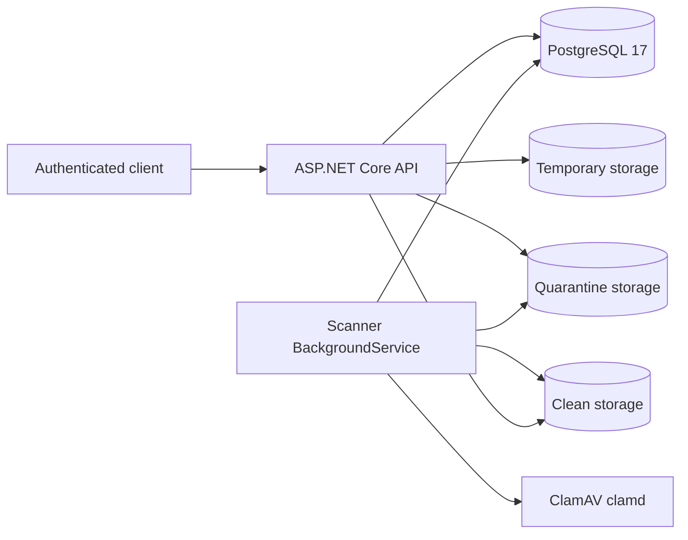
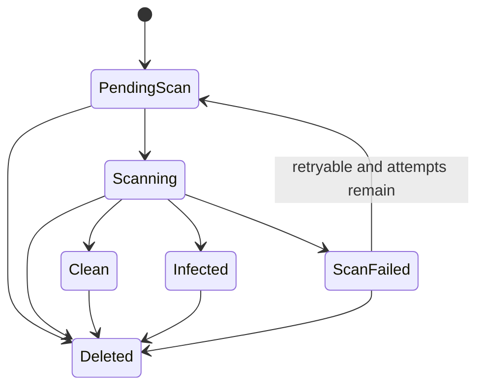

# Architecture

## System shape

FileSentry is a .NET 10 modular monolith. One ASP.NET Core process hosts the HTTP
API and the durable scanner `BackgroundService`. PostgreSQL is the workflow source
of truth; local storage holds bytes under generated names; ClamAV scans streamed
content over TCP.



The worker is drawn separately to show its responsibility, but it runs in the same
deployable application as the API.

## Component responsibilities

### HTTP API

- registers users and issues short-lived JWT access tokens;
- streams a single authenticated multipart upload while enforcing the actual
  10 MiB limit and calculating SHA-256;
- verifies allowed extensions against server-detected PDF, PNG, JPEG, or valid Word
  Open XML DOCX content;
- creates a durable `PendingScan` record only when bytes and metadata can be
  committed safely;
- returns only owner-scoped metadata and streams only owner-scoped `Clean` bytes;
- coordinates deletion with current scanner state and audit persistence.

### PostgreSQL

PostgreSQL contains Identity users, `FileRecord`, `ScanAttempt`, and `AuditEvent`
rows. File status, ownership, retry timing, active scan claims, and storage state are
database decisions. A file appearing in a directory never makes it downloadable by
itself.

### Scanner worker

The worker claims eligible jobs with PostgreSQL row locks, persists `Scanning` and
attempt state, sends the quarantine stream through ClamAV `INSTREAM`, and classifies
the complete response. Clean files are promoted, infected bytes are deleted, and
inconclusive results fail closed. Retries are bounded and stale claims are
recoverable after process termination.

### Storage

`Storage:RootPath` resolves to a fixed trusted root outside the web root. At startup
the application creates:

```text
data/
|-- temp/
|-- quarantine/
`-- clean/
```

Paths combine those roots only with generated names. Original filenames are safe
display/download metadata. Storage is not exposed by static-file middleware.

### ClamAV

Readiness uses `PING`; scans use `INSTREAM`. The application sends file bytes rather
than filesystem paths. In the current host-development topology, Compose binds port
3310 to loopback only because the API is outside Docker.

## Durable state model



Only `Clean` plus a matching clean-storage state permits download. `ScanFailed` is
never treated as clean.

## Request security pipeline

1. Correlation middleware validates one supplied `X-Correlation-ID` or generates
   one.
2. Authentication validates issuer, audience, lifetime, signature, and subject.
3. Authorization requires an authenticated caller for file routes.
4. Focused rate-limit policies partition authentication by IP and uploads by user.
5. Controllers pass identity and correlation to focused application services.
6. Database queries include both file ID and owner ID for object access.
7. ProblemDetails responses expose stable codes without sensitive diagnostics.

## Deployment boundary

Docker Compose currently supplies PostgreSQL and ClamAV only. The API runs on the
host with secrets supplied through .NET User Secrets or equivalent external
configuration. This is reproducible local infrastructure, not a production
deployment topology. See the [README](../README.md) for exact setup.
